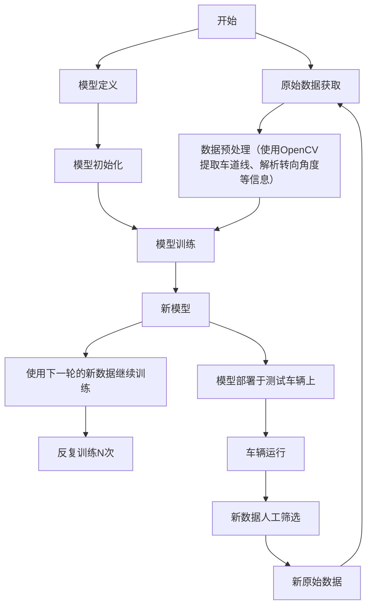

<div align="center"><h1>QYun Trail：青云循迹</h1></div>
<div align="center">修篁而待彩凤，抱璞以达青云</div>

## 项目简介

基于深度学习的循迹系统，通过类似RLHF的方法反复收集训练数据，根据人类喜好筛选并重新训练。

系统流程图：



模型简介：[model.md](./model.md)

## 训练准备

### 配置文件

配置文件使用 TOML 格式，具体格式及其含义请见 [_config.py](./utils/_config.py)。

通过修改 [config.py](./config.py) 文件来指定配置文件路径。

```python
from utils import load_config
config = load_config("/path/to/config.toml")
```

### 数据准备

将数据放置于 `dataset` 目录下，每帧画面为一幅图像，其标注信息在其文件名中。

文件名格式如下：

```
{frame_id}_{steering_angle}_{speed}.jpg
```

其中：

- `frame_id`：帧序号
- `steering_angle`：转向角度
    $\mathrm{steering\_angle} = \lfloor (\mathrm{raw\_angle} + 1) \times 1000 \rfloor$
- `speed`：车速
    $\mathrm{speed} = \lfloor \mathrm{raw\_speed} \times 10 \rfloor$

如果你暂时没有数据，可以使用 `scripts/generate_test_dataset.py` 脚本生成一些随机数据。

```shell
python3 ./scripts/generate_test_dataset.py
```

### 数据预处理

```shell
python3 ./scripts/preprocess.py
```

如果需要自定义配置文件可以使用 `-c` 参数指定配置文件路径。

```shell
python3 ./scripts/preprocess.py -c /path/to/config.toml
```

## 训练

使用预设的配置进行训练：

```shell
python3 ./scripts/train.py
```

## 开源协议

本项目以自定义开源许可证形式开源。


