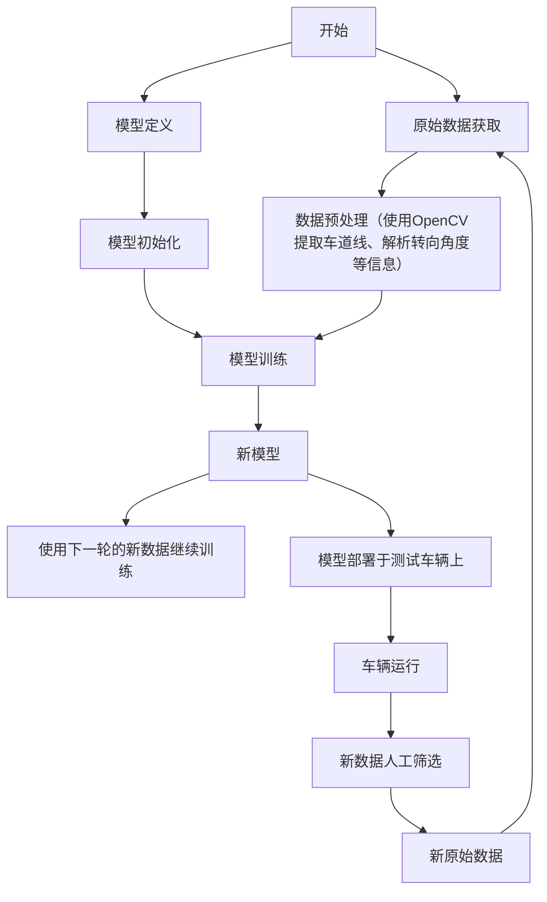

<h1>QYun Trail：青云循迹</h1>

修篁而待彩凤，抱璞以达青云

## 项目简介

智能车完模深度学习循迹系统，通过类似RLHF的方法反复收集训练数据，根据人类喜好筛选并重新训练。

```mermaid
graph TD;
    A[开始] --> B[原始数据获取];
    B --> C["数据预处理（使用OpenCV提取车道线、解析转向角度等信息）"];
    A --> Model;
    Model[模型定义] --> M1[模型初始化];
    M1 --> E;
    C --> E[模型训练];
    E --> E2[新模型];
    E2 --> E3[使用下一轮的新数据继续训练]
    E2 --> F[模型部署于测试车辆上];
    F --> F2[车辆运行]
    F2 --> G[新数据人工筛选];
    G --> H[新原始数据];
    H --> B;
```

## 开源协议

本项目以自定义开源许可证形式开源。

